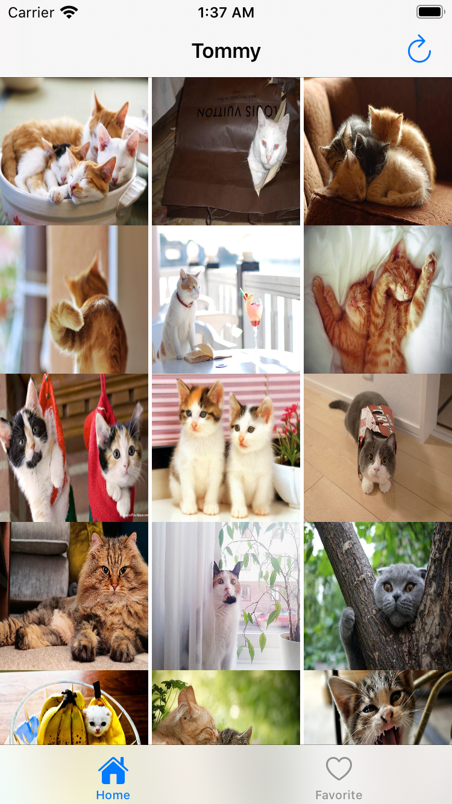
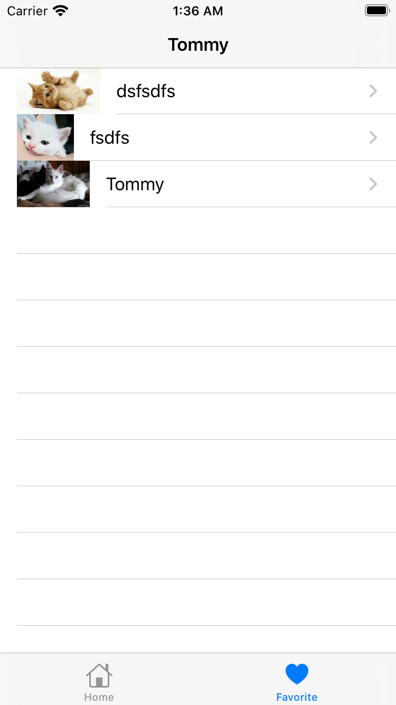
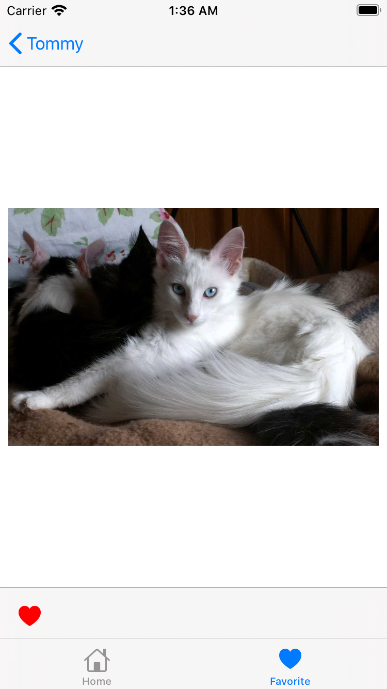
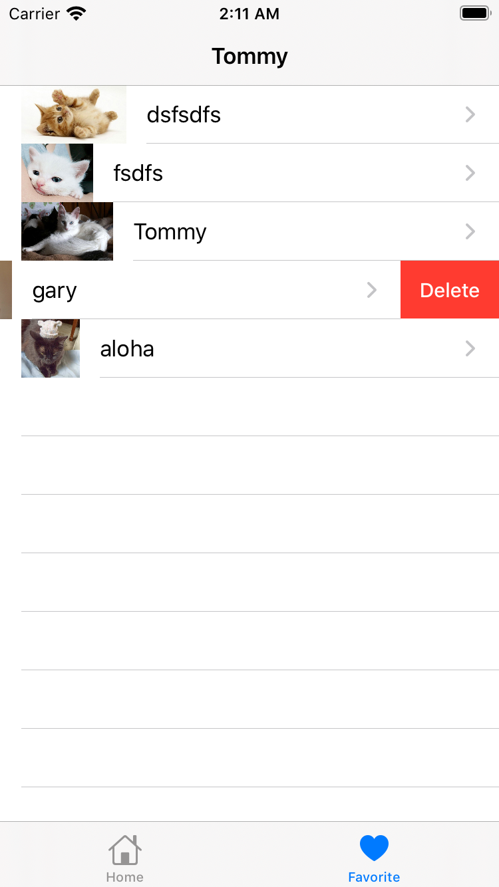

# Tommy

This app use  [The Cat Api](https://thecatapi.com) to download and store photos in your device.also you can add some pic in your favorite list

## What you need to do

This app use [The Cat Api](https://thecatapi.com) to get pictures.
so you need sign up in [The Cat](https://thecatapi.com) and get your api key.

After you get your api key modify this file **TommyApi.swift**

```swift
     var headers: [String : String]? {
        return ["Content-type": "application/json; charset=utf-8","x-api-key" : "Your API Here"]
    }
```

And also I use [Moya](https://github.com/Moya/Moya) to handle my network stuff.

[Moya](https://github.com/Moya/Moya) is one of the  powerfull library to handle your network request in your projects


## Screenshots
<dive>




</dive>